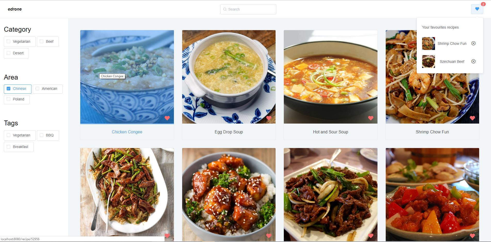

# Recruitment-task
Recruitment task for the [edrone]

Live version: [live]

### About
I created UI/UX based on image from endrone. Application is based on Vue.js with Vue-router and Vuex and Element desktop UI library which support Vue and components architecture. I had some problems with API, cause I had to edit API properties for render and deleted blank unnecessary objects. However, at the end, I'm satisfacted from this results. 

### Features
- Responsive UI based on [Element] - Vue Desktop UI Library
- Reactive filtration and searching for local recipes
- AJAX Http Request for the server by [TheMealDB] API
- Dynamic routing for clicked recipes
- Saving data (favourites recipes) to localstorage on user's computer
- Reactive preloader for loading application



### Used libraries/Technologies:
  - Vue.js 2
  - Vuex
  - Vue-router
  - Javascript (ES6+)
  - SCSS
  - Axios Ajax library
  - Vue-youtube component 
  - Element Vue Desktop UI Library


### API 
| HTTP method | URI path | Description |
| ----------- | -------- | ----------- |
| GET | api/json/v1/1/latest.php |  Retrieves last 10 recipes from database

### Install
```sh
$ npm install
```

### Run

```sh
$ npm run serve
```

### Build

```sh
$ npm run build
```

[edrone]: https://edrone.me/en/
[TheMealDB]: https://www.themealdb.com/
[Element]: https://element.eleme.io/#/en-US
[live]: https://kind-joliot-41a03d.netlify.com/
